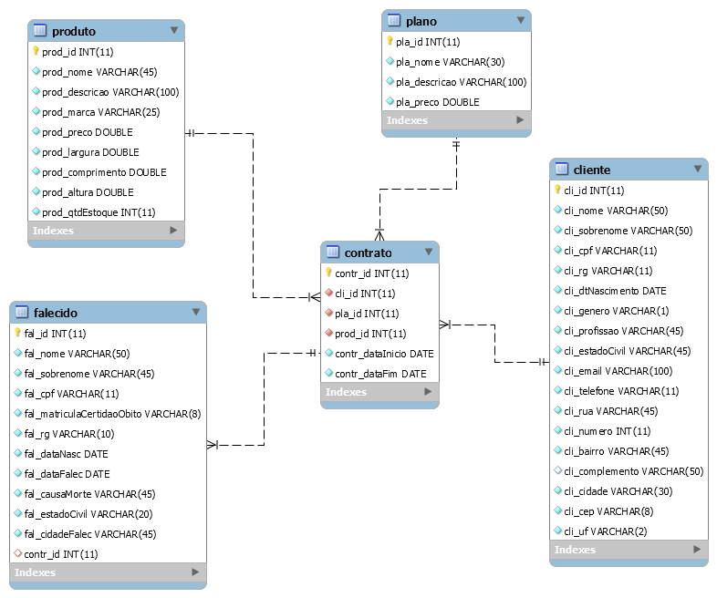

-- para editar as telas é necessário instalar o SceneBuilder (na construção do projeto foi utilizado o 8.5.0)

-- para conexão com o banco é necessário importar o arquivo .jar em 'Bibliotecas'

--- teste push

